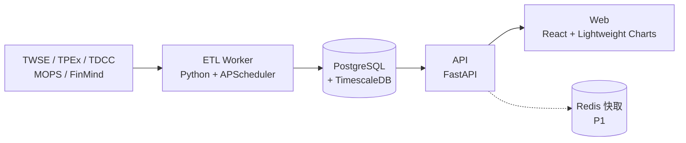

# TwStock 專案設計計劃

2026-09-17 · Yu-Chih ｜ 線上版：https://claude.ai/code/artifact/81713bf5-0494-47e6-8fff-bdba43f20a9b

## 目標與範圍

目標是一套自架的台股查詢系統：每天盤後自動抓資料進資料庫，打開網頁就能看個股 K 線、籌碼、基本面。使用者只有自己，不做交易、不做即時報價，先求資料完整、查詢快。

MVP 做到三件事：

1. **每日盤後 ETL**：上市（TWSE）+ 上櫃（TPEx）全部個股的日 K、三大法人、融資融券，自動寫入 DB。
2. **個股頁**：輸入代號或名稱 → K 線 + 均線 + 成交量 + 法人買賣超 + 融資餘額，同一時間軸對齊。
3. **歷史回補**：至少回補 5 年日資料，之後每天增量。

不在 MVP：盤中即時報價、下單、多人帳號、回測引擎、手機 App。

## 台股需求盤點

資料依更新頻率分三層：每日盤後、每週/每月、每季。P0 進 MVP，P1 第二階段，P2 之後再說。

| 資料類別 | 內容 | 更新頻率 | 公布時間（約） | 優先度 |
| --- | --- | --- | --- | --- |
| 個股清單 | 代號、名稱、市場別（上市/上櫃/興櫃）、產業別、上市日、ETF 標記 | 每日 | 盤前 | P0 |
| 日成交（日 K） | 開高低收、成交股數、成交金額、成交筆數、漲跌 | 每日 | 14:30 後 | P0 |
| 還原股價 | 除權息調整後價格（畫長期 K 線必備） | 除權息日 | 除權息當天 | P0 |
| 三大法人 | 外資、投信、自營商買賣股數與買賣超 | 每日 | 15:00–16:00 | P0 |
| 融資融券 | 融資/融券買賣、餘額、限額、資券比 | 每日 | 21:00 左右 | P0 |
| 借券賣出 | 借券賣出量、餘額 | 每日 | 21:00 左右 | P1 |
| 外資持股 | 外資持股比例、尚可投資比例 | 每日 | 盤後 | P1 |
| 集保股權分散 | 各持股級距人數與股數（大戶/散戶比例） | 每週 | 週五或週六 | P1 |
| 月營收 | 當月營收、MoM、YoY、累計 | 每月 | 每月 10 日前 | P1 |
| 財報 | 損益表、資產負債表、現金流量表、EPS | 每季 | 5/15、8/14、11/14、3/31 前 | P1 |
| 股利政策 | 現金/股票股利、除權息日 | 每年為主 | 董事會後 | P1 |
| 本益比 / 殖利率 / PB | PER、殖利率、股價淨值比 | 每日 | 盤後 | P1 |
| 分點進出 | 各券商分點買賣 | 每日 | 盤後 | P2 |
| 大盤 / 指數 | 加權指數、櫃買指數、類股指數 | 每日 | 14:30 後 | P0 |

技術指標（MA 5/10/20/60/120/240、KD、MACD、RSI、布林通道）不存 DB，前端或 API 即時算；要做全市場選股時再加物化表。週 K / 月 K 由日 K 聚合產生。

## 資料來源

建議「官方來源做每日增量、FinMind 做歷史回補與財報」。官方資料免費且最準，但格式零散、歷史要逐日抓；FinMind 已整理好、有還原股價，但有每小時呼叫上限。

| 來源 | 涵蓋資料 | 歷史資料 | 限制 | 用途 |
| --- | --- | --- | --- | --- |
| [TWSE OpenAPI](https://openapi.twse.com.tw/) | 上市收盤行情、本益比、融資融券、公司基本資料 | 多數只給最新一日 | 免費，需控制頻率 | 每日增量（上市） |
| TWSE 網站報表端點（`/rwd/zh/afterTrading/STOCK_DAY`、`/rwd/zh/fund/T86` 等） | 個股月成交、三大法人、融資融券 | 可帶日期查歷史 | 太頻繁會被擋 IP，建議每次間隔 3–5 秒 | 補漏、備援 |
| [TPEx OpenAPI](https://www.tpex.org.tw/openapi/) | 上櫃/興櫃行情、法人、融資融券 | 多數只給最新一日 | 免費 | 每日增量（上櫃） |
| [集保開放資料](https://opendata.tdcc.com.tw/) | 集保戶股權分散表 | 只有最新一週 | 免費 | 每週抓一次，**漏抓就補不回來** |
| [公開資訊觀測站 MOPS](https://mops.twse.com.tw/) | 月營收、財報、股利、重大訊息 | 有 | 爬蟲易被擋 | 月營收與公告 |
| [FinMind](https://finmind.github.io/) | 50+ 資料集：股價、還原股價、法人、融資融券、股權分級、財報、月營收 | 有，多年 | 依會員等級限每小時次數，超過回 402 | 歷史回補、財報、還原股價 |

註：FinMind 各等級的實際次數上限文件沒寫清楚（免費註冊約 600 次/小時，屬近似值），註冊後用 user_info 端點查 `api_request_limit` 確認。之前選股器已經有 FinMind token，可直接沿用。

每日排程（台北時間）：15:30 抓行情+指數 → 16:30 抓三大法人 → 21:30 抓融資融券/借券 → 週六 10:00 抓集保分散 → 每月 1–11 日每天抓月營收。每個 job 寫入 `etl_job_log`，失敗自動重試 3 次。

## 系統架構

四個元件全部用 Docker Compose 起，先跑在本機（Mac），之後要搬到 NAS / VPS / K8s 只是換部署方式。

| 元件 | 選型 | 為什麼 |
| --- | --- | --- |
| ETL | Python 3.12、httpx、pandas、APScheduler | 台股資料生態幾乎都是 Python；FinMind 有官方 SDK |
| 資料庫 | PostgreSQL 16 + TimescaleDB | 時間序列自動分區、壓縮；週 K/月 K 用 continuous aggregate；仍是標準 SQL |
| API | FastAPI + SQLAlchemy | 跟 ETL 同語言，共用 model；自帶 OpenAPI 文件 |
| 前端 | React + Vite + TypeScript、[Lightweight Charts](https://tradingview.github.io/lightweight-charts/)（K 線）、ECharts（籌碼/財報圖） | Lightweight Charts 專為 K 線設計、體積小、幾千根 K 棒不卡 |
| 部署 | Docker Compose（P0）→ Helm chart（選配） | 熟 K8s/Helm，之後要上叢集很順 |

替代方案：不想跑 Postgres 就用 DuckDB 單檔，個人查詢效能夠，但多進程同時寫入較麻煩。

## 資料庫設計

每張表以 `(stock_id, trade_date)` 為主鍵，每日資料表轉成 TimescaleDB hypertable（按月分區）。寫入一律 `INSERT ... ON CONFLICT DO UPDATE`，重跑不會重複。全市場約 2,000 檔 × 250 天 ≈ 每年 50 萬筆日 K，資料量很小。

| 資料表 | 主鍵 | 主要欄位 | 類型 |
| --- | --- | --- | --- |
| `stock` | stock_id | name, market(TWSE/TPEx/ESB), industry, listed_date, is_etf, is_active | 維度表 |
| `trading_calendar` | trade_date | is_open, note | 維度表 |
| `daily_price` | stock_id, trade_date | open, high, low, close, volume, turnover, transactions, change | hypertable |
| `adj_factor` | stock_id, ex_date | factor, cash_dividend, stock_dividend | 事件表（還原價 = close × 累乘 factor） |
| `institutional_daily` | stock_id, trade_date | foreign_buy/sell/net, trust_buy/sell/net, dealer_buy/sell/net | hypertable |
| `margin_daily` | stock_id, trade_date | margin_buy/sell/balance/limit, short_buy/sell/balance, sbl_sell/balance | hypertable |
| `foreign_holding` | stock_id, trade_date | holding_shares, holding_ratio, available_ratio | hypertable |
| `valuation_daily` | stock_id, trade_date | per, pbr, dividend_yield | hypertable |
| `shareholding_dist` | stock_id, week_date, level | holders, shares, ratio | 週資料，level 1–17 |
| `monthly_revenue` | stock_id, year_month | revenue, mom, yoy, ytd_revenue, ytd_yoy | 月資料 |
| `financial_statement` | stock_id, period, item_code | value, statement_type(IS/BS/CF) | 長表（EAV），常用項目另建 view |
| `dividend` | stock_id, fiscal_year | cash_div, stock_div, ex_div_date, ex_right_date | 年資料 |
| `index_daily` | index_id, trade_date | open, high, low, close, volume | hypertable |
| `watchlist` | list_id, stock_id | added_at, note | 使用者資料 |
| `etl_job_log` | job_id | job_name, target_date, status, rows, error, started_at, finished_at | 維運 |

其他決定：週 K / 月 K 用 continuous aggregate `price_weekly`、`price_monthly`；兩年以上的 chunk 開壓縮；金額用 `NUMERIC`、股數用 `BIGINT`（單位統一為「股」，不存「張」）；額外索引 `(trade_date)` 給全市場排行用。Schema 變更用 Alembic 管。

## 網頁設計

核心是個股頁：上半 K 線、下半多個副圖共用同一時間軸，滑鼠移到哪天，所有副圖同步顯示那天數字。配色照台股習慣：紅漲綠跌。

| 頁面 | 路徑 | 內容 | 優先度 |
| --- | --- | --- | --- |
| 首頁 / 大盤 | `/` | 加權/櫃買指數、漲跌家數、法人合計買賣超、自選股摘要 | P0 |
| 個股頁 | `/stock/:id` | 見下方版面 | P0 |
| 搜尋 | 全站頂部 | 代號/名稱/拼音模糊搜尋，`/` 快捷鍵 | P0 |
| 自選股 | `/watchlist` | 多組清單，表格顯示收盤、漲跌、法人連買天數、融資變化 | P1 |
| 排行 | `/ranking` | 法人買超、成交量爆增、營收創新高、大戶比例增加 | P1 |
| 簡易選股 | `/screener` | 條件組合（PER、殖利率、YoY、法人連買 N 天） | P2 |
| 系統狀態 | `/admin/etl` | 各 job 最後執行時間、成功/失敗、手動重跑 | P0 |

個股頁版面（由上到下）：

1. **標頭列**：代號、名稱、產業、收盤價、漲跌幅、成交量、PER / PBR / 殖利率、加入自選。
2. **主圖 K 線**：日/週/月切換、還原價開關、MA 5/20/60 疊圖、布林通道可選、區間 3M/6M/1Y/3Y/5Y。
3. **副圖（可排序/開關）**：成交量 → 三大法人買賣超（堆疊柱）→ 融資融券餘額（雙線）→ KD / MACD / RSI。
4. **籌碼分頁**：集保分散趨勢（400 張以上大戶比例 vs 股價）、外資持股比例趨勢、法人連續買賣天數。
5. **基本面分頁**：月營收柱狀 + YoY 線、季 EPS、毛利率/營益率/淨利率趨勢、歷年股利表。

API 端點草案：`GET /api/stocks?q=`、`GET /api/stocks/{id}/price?freq=D&adj=true&from=&to=`、`/institutional`、`/margin`、`/shareholding`、`/revenue`、`/financials`、`GET /api/market/summary`。個股頁一次呼叫帶回 5 年日資料約 1,250 筆，不需要分頁。

## 開發里程碑

分四階段，每階段結束都是可用的系統。工時以下班時間估，合計約 8–10 週。

| 階段 | 交付內容 | 完成標準 | 預估 |
| --- | --- | --- | --- |
| M0 骨架 | Docker Compose（Postgres+Timescale、API、Web、ETL）、Alembic migration、`stock` 與 `trading_calendar` | `docker compose up` 後能搜尋到全部個股 | 1 週 |
| M1 價格 + K 線 | `daily_price`、`adj_factor`、`index_daily` ETL 與 5 年回補；個股頁 K 線 + 均線 + 成交量；ETL 狀態頁 | 任一個股看到正確還原 K 線，每天 15:30 後自動更新 | 2–3 週 |
| M2 籌碼 | 三大法人、融資融券、借券、外資持股、集保分散；副圖與籌碼分頁 | 個股頁副圖與主圖十字線同步 | 2–3 週 |
| M3 基本面 + 工具 | 月營收、財報、股利、估值；自選股、排行、簡易選股 | 營收公布當天會出現在排行 | 3 週 |

建議一開始就先跑集保分散的每週排程（即使 M2 還沒做前端），因為這份資料官方只給最新一週，越早開始存歷史越長。

## 風險與待決事項

| 風險 | 影響 | 對策 |
| --- | --- | --- |
| 官方站擋 IP / 改格式 | 當天資料缺漏 | 請求間隔 3–5 秒、每個來源寫 parser 單元測試、失敗改用 FinMind 補 |
| FinMind 次數不夠回補 | 5 年 × 2,000 檔會卡很久 | 按「資料集 × 日期」抓全市場（有些資料集支援不帶 stock_id），或用官方報表端點逐日慢慢回補 |
| 還原價計算錯 | 長期 K 線與均線失真 | 拿 FinMind 還原價抽樣比對自算結果 |
| 下市、改名、轉市場 | 歷史資料對不起來 | `stock.is_active` + 變更歷程表，代號不重用 |
| 資料授權 | 轉成公開服務有法規問題 | 維持個人使用、不對外公開 |

待決事項：

- [ ] 部署位置：本機 Mac、NAS、還是雲端 VPS（影響排程是否 24 小時靠得住）
- [ ] 歷史回補年限：5 年還是 10 年
- [ ] 是否含興櫃與 ETF
- [ ] FinMind 要不要升級付費會員
- [ ] 需不需要登入驗證（只在內網用可以先省略）

## 來源

- [FinMind 文件](https://finmind.github.io/)、[FinMind API 使用次數](https://finmind.github.io/api_usage_count/)
- [TWSE OpenAPI](https://openapi.twse.com.tw/)、[TPEx OpenAPI](https://www.tpex.org.tw/openapi/)、[集保開放資料](https://opendata.tdcc.com.tw/)、[MOPS](https://mops.twse.com.tw/)
- [TradingView Lightweight Charts](https://tradingview.github.io/lightweight-charts/)
