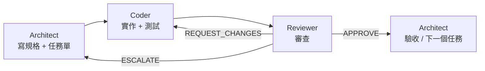

# TwStock Agent 團隊

| 角色 | 模型 | Effort | 產出位置 | 職責 |
| --- | --- | --- | --- | --- |
| Architect | Opus 5（`claude-opus-5`） | High | `docs/specs/`、`docs/decisions.md` | 拆任務、寫規格、技術決策、最終驗收 |
| Coder | Haiku 4.5（`claude-haiku-4-5`） | Medium | `etl/`、`api/`、`web/`、`db/`、`deploy/`、`scripts/` | 依任務單實作與測試 |
| Reviewer | Sonnet 5（`claude-sonnet-5`） | Medium | `docs/reviews/` | 對照規格審查、跑測試、寫審查報告 |

Agent 定義檔：`.claude/agents/architect.md`、`coder.md`、`reviewer.md`。

## 流程

1. Architect 為里程碑產出 `docs/specs/M<n>-<slug>.md`，列出任務 T<n>-<k> 與相依順序。
2. 每個任務：Coder 實作 → Reviewer 審查 → 最多來回 2 次，第 3 次仍不過就 ESCALATE 給 Architect。
3. 里程碑內所有任務 APPROVE 後，Architect 跑里程碑驗收條件，更新 `README.md` 進度。

## 狀態追蹤

每份規格文件底部維護任務狀態表：`TODO` → `IN_PROGRESS` → `IN_REVIEW` → `DONE`（或 `BLOCKED`）。
